# Goldin-Go Architecture

Goldin-Go is currently a small full-stack project centered on an Identity bounded context. The Go API follows a ports-and-adapters shape: HTTP handlers adapt incoming requests into application commands, application services coordinate use cases through interfaces, and concrete adapters handle persistence, password hashing, and token issuing.

## System Context

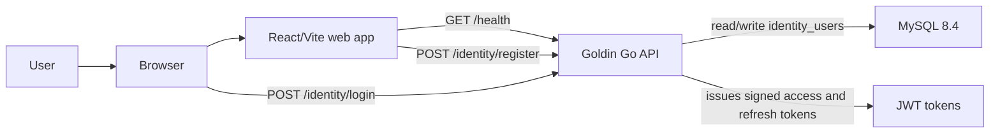

The frontend is a Vite React app. During development, Vite proxies `/health` and `/identity/*` to the API target configured by `VITE_API_TARGET`, defaulting to `http://127.0.0.1:8081`.

## Startup And Dependency Wiring

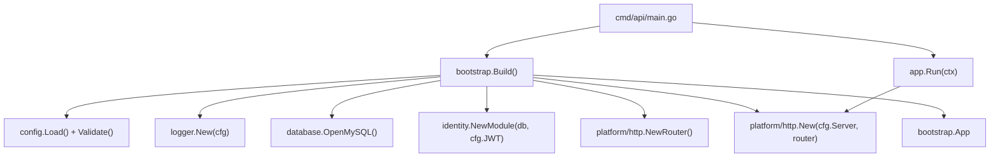

Startup is intentionally centralized in `internal/platform/bootstrap`. That keeps construction of infrastructure and modules out of business logic. `App.Run` starts the HTTP server, listens for context cancellation, then performs graceful HTTP shutdown and closes the database connection.

## Backend Layers

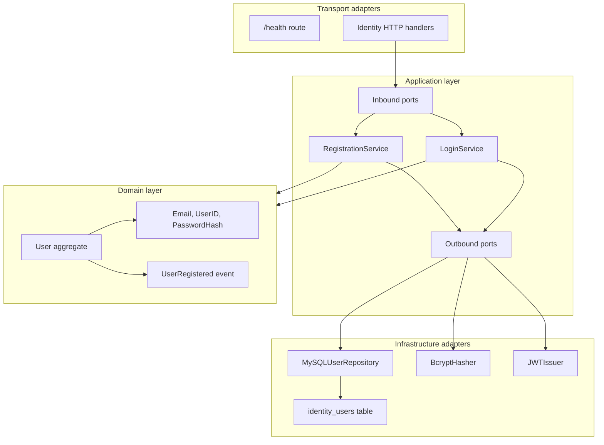

The dependency direction points inward. The application services know about ports, commands, results, and domain objects. They do not know the details of HTTP, SQL queries, bcrypt, or JWT signing. Those details are plugged in by adapters during module construction.

## Identity Module Composition

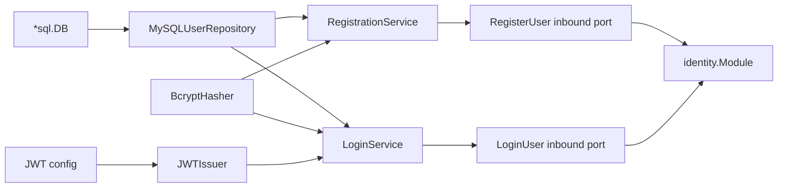

`identity.NewModule` is the composition root for the Identity bounded context. It creates a MySQL repository, a bcrypt password hasher/verifier, a JWT issuer, then exposes only the inbound use case interfaces needed by HTTP.

## Registration Workflow

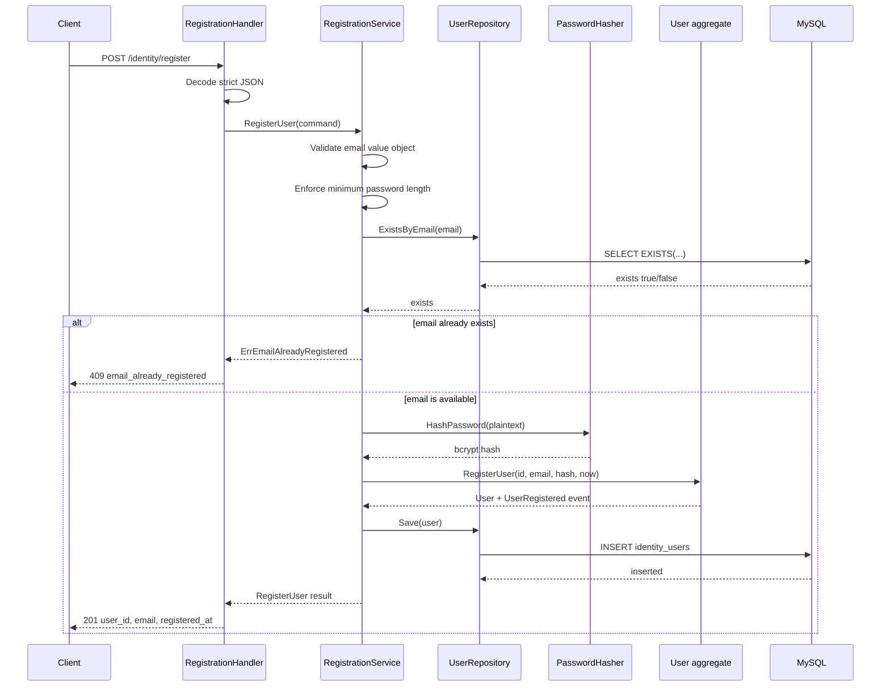

Registration is defensive at several layers. The HTTP layer rejects invalid JSON and unknown fields. The service validates email and password rules, checks uniqueness before hashing, and still handles the database unique constraint as a conflict. The domain aggregate records a `UserRegistered` event, although no event publisher is wired yet.

## Login Workflow

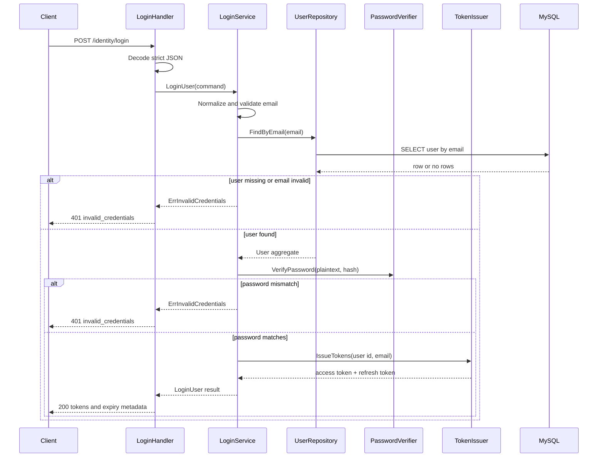

Login deliberately collapses invalid email, missing user, and password mismatch into the same public error: `invalid_credentials`. That prevents the API from revealing which email addresses are registered.

## HTTP Request Pipeline

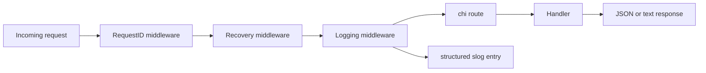

Every request receives or reuses an `X-Request-ID`. Panics are recovered into a 500 response and logged with request context. Completed requests are logged with method, path, status, request ID, and duration.

## Data Model

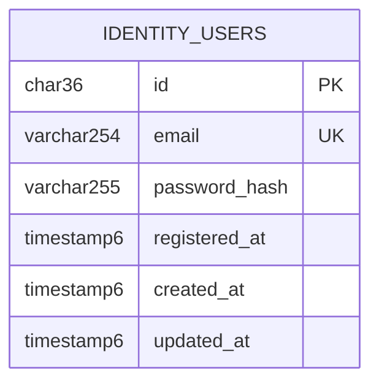

The only database table in the current migrations is `identity_users`. The email uniqueness constraint is part of the business rule enforcement, not just an index optimization.

## Frontend Flow

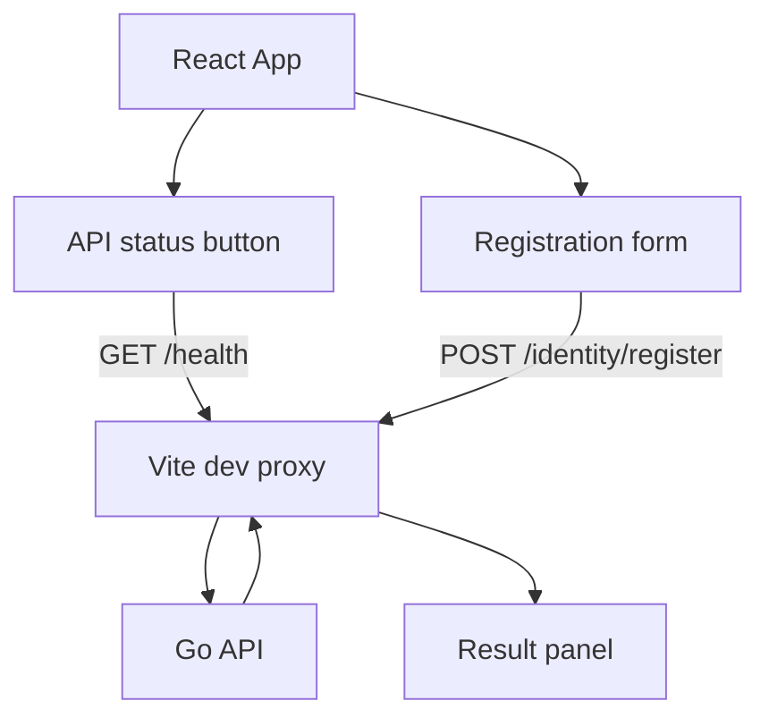

The web app currently focuses on registration and API health. It uses local component state for form fields, submission state, API status, success payloads, and errors. It does not yet include a login screen even though the backend login endpoint exists.

## Configuration And Operations

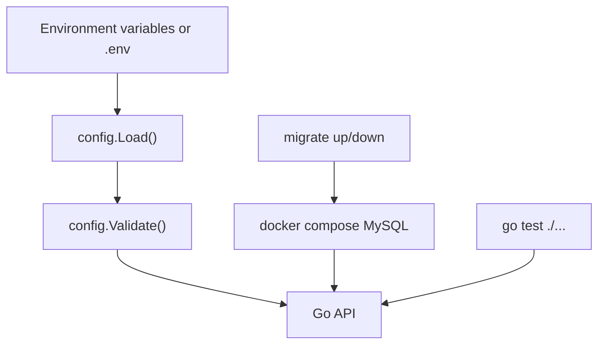

Important runtime configuration includes `DB_HOST`, `DB_USER`, `DB_NAME`, `JWT_SECRET`, server host/port, database pool limits, token durations, and log level. Docker Compose provides MySQL only; schema creation is handled separately through the migration commands in the `Makefile`.

## Extension Points

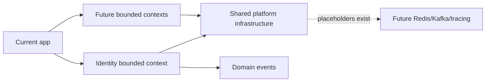

The bootstrap structs already leave room for Redis, Kafka, and tracing, but those are placeholders. The next natural extensions would be adding event publication for `UserRegistered`, adding authenticated routes that verify JWTs, and expanding the web app to include login and token-aware API calls.
